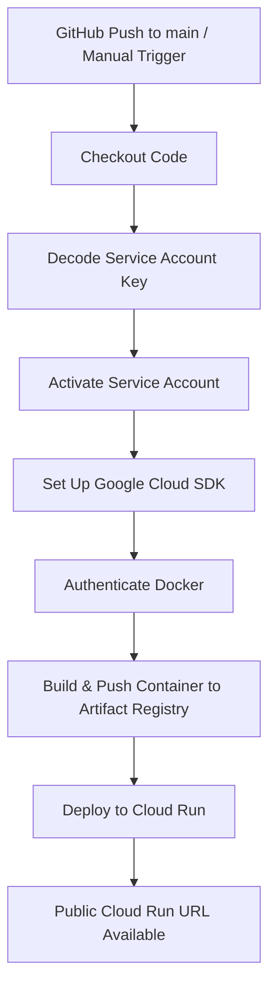

# Transcript Summarization Agent with Vertex AI Agent Engine

This project demonstrates how to build, test, deploy, and manage an agent using the **Google Agent Development Kit (ADK)** and **Vertex AI Agent Engine**.

## 🧠 Agent Description
A simple AI agent that summarizes chat transcripts using Gemini models via Vertex AI.

---

## 📁 Project Structure
```
transcript_summarization_agent/
├── .env                                # Environment config
├── requirements.txt                    # Python dependencies
├── __init__.py                         # Package init
├── agent.py                            # ADK agent definition
├── deploy_to_agent_engine.py          # Deployment script
├── test_agent_app_locally.py          # Local test using AdkApp
├── query_app_on_agent_engine.py       # Query deployed agent
├── agent_engine_utils.py              # List/Delete agents
├── cloud_run_adk_api.py               # Cloud Run API to query the agent
```

---

## ⚙️ Setup Instructions

### 1. Clone Repo and Set Up Environment
```bash
git clone <your-repo-url>
cd transcript_summarization_agent
python3 -m venv venv
source venv/bin/activate
pip install -r requirements.txt
```

### 2. Configure Environment
Update `.env` with your values:
```env
GOOGLE_GENAI_USE_VERTEXAI=TRUE
GOOGLE_CLOUD_PROJECT=<your-gcp-project-id>
GOOGLE_CLOUD_LOCATION=us-central1
MODEL=gemini-2.0-flash-exp
APP_NAME="Transcript Summarizer"
```

### 3. Authenticate to GCP (Optional Locally)
```bash
gcloud auth application-default login
gcloud config set project <your-gcp-project-id>
```

---

## 🧪 Test Agent Locally
```bash
python3 test_agent_app_locally.py
```

---

## 🚀 Deploy Agent to Vertex AI Agent Engine
```bash
python3 deploy_to_agent_engine.py
```

---

## 🔍 Query Deployed Agent
```bash
python3 query_app_on_agent_engine.py
```

Alternatively, if you're using Cloud Run to expose your agent API:

### 🌐 Query Agent via Cloud Run
```bash
curl -X POST https://<your-cloud-run-url>/query \
  -H "Content-Type: application/json" \
  -d '{
    "text": "Hi, I want to summarize a transcript.",
    "userId": "user_001",
    "sessionId": "session_001"
  }'
```

#### Example:

```bash
curl -X POST https://adk-agent-api-1014227239898.asia-south1.run.app/query \
  -H "Content-Type: application/json" \
  -d '{
    "text": "Hi, I want to buy a boat",
    "userId": "u_456",
    "sessionId": "session_001"
  }'
```

Response:
```json
{
  "response": "OK. What kind of boat are you looking for?\n"
}
```

---

## 🧹 List or Delete Deployed Agents

### List
```bash
python3 agent_engine_utils.py list
```

### Delete
```bash
python3 agent_engine_utils.py delete <RESOURCE_NAME>
```

---

## ✅ GitHub Actions CI/CD Support
This repo can be integrated with GitHub Actions for:
- Deploying the agent
- Listing agents
- Deleting agents

See `.github/workflows/adk-agent-engine.yml` for workflow configuration.

### 📦 ADK GitHub Actions Flow

```mermaid
graph TD
  A[Workflow Dispatch Trigger<br>(Action: deploy, list, delete, query, test)] --> B[Checkout Repo]
  B --> C[Set up Python 3.12]
  C --> D[Install Dependencies]
  D --> E[Authenticate with GCP]
  E --> F[Decode Service Account Key]
  F --> G[Set GCP Environment Variables]

  G --> H1[Deploy Agent (deploy)]
  G --> H2[List Agents (list)]
  G --> H3[Delete Agent (delete)]
  G --> H4[Query Agent (query)]
  G --> H5[Test Agent Locally (test)]
```

---

## 🧠 Architecture Overview

1. **ADK Agent**: You define your logic using `google.adk` and deploy it using `deploy_to_agent_engine.py`.
2. **Vertex AI Agent Engine**: Hosts the deployed agent, accessible via Google Cloud's secure APIs.
3. **Cloud Run API**: Provides an HTTP frontend (`cloud_run_adk_api.py`) that receives user input and communicates with the Vertex agent.
4. **GitHub Actions**: Automates CI/CD, including build, deploy, and test stages for both the agent and the Cloud Run service.

### 🔁 Flow

```mermaid
graph TD
    A[Client\n(Flutter app / Postman)] --> B[Cloud Run API\n(cloud_run_adk_api.py)]
    B --> C[Vertex AI Agent Engine]
    C --> D[Gemini Model\nGenerates Response]
```

---

### 🧩 GitHub Actions Workflow



---

## 📚 Resources
- [Vertex AI Agent Engine Documentation](https://cloud.google.com/vertex-ai/docs/agent-builder)
- [Google ADK on PyPI](https://pypi.org/project/google-adk/)
- [Qwiklabs: Deploy ADK Agents to Agent Engine](https://www.cloudskillsboost.google/)
